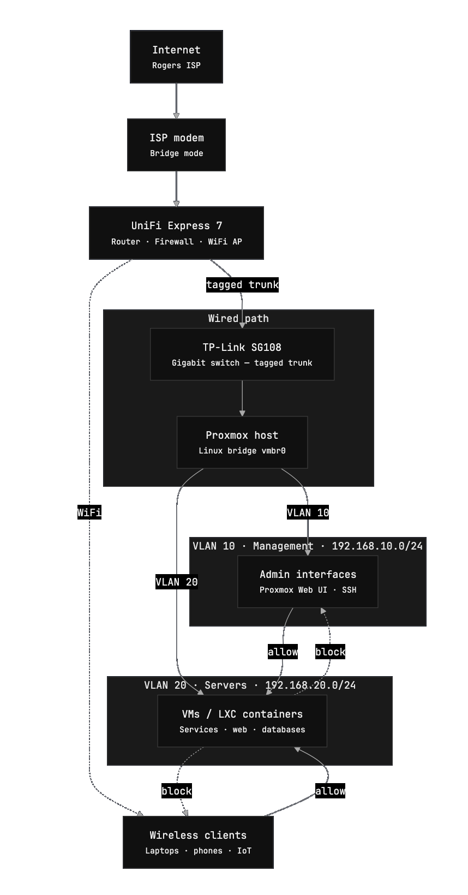

import Callout from '@/components/Callout.astro'
import { Icon } from 'astro-icon/components'

## Overview

The networking layer of the homelab is intentially small and simple. 
The goal of this setup is to maximize stability while also not making compromises to security and isolation.

The entire network is built around a 2 main devices:

- **UniFi Express 7 router**
- **TP-Link SG108 gigabit switch**

Despite the small number of devices, this setup provides full routing, firewall control, and internal connectivity for the lab.

---

## Internet Connection

My internet service is provided by Rogers. The ISP modem is configured in **bridge mode**, which disables its routing and Wi-Fi functionality.

This allows the UX7 to have full control of routing, firewall rules, VLANs, DHCP, etc.

<Callout title="Why bridge mode?" variant="tip">
Running the ISP modem in bridge mode prevents **double NAT** and ensures that the router receives the public IP address directly. This gives significantly better control over networking, firewall rules, and prevents having to port forward through both devices.
</Callout>

With bridge mode enabled, the modem effectively acts as a simple gateway that passes internet traffic directly to the router.

---

## Router

The heart of the whole network is the **UniFi Express 7 (UX7)**.

This device is responsible for nearly everything network related, including:

- VLAN segmentation
- routing between networks
- firewall rules
- DHCP
- device monitoring
- Wi-Fi
- 802.11Q trunking to the switch

One of the biggest advantages of the UniFi ecosystem is the remote management interface. From anywhere in the world I can easily view:

- connected devices
- bandwidth usage
- network topology
- firewall events

This visibility makes troubleshooting significantly easier when experimenting with new services in the homelab.

---

## Switching

Wired connectivity is handled by a **TP-Link SG108**, an 8-port gigabit switch.

The switch connects all of the wired devices as well as VLAN trunking and tagging from the UX7 to the main virtualization host.

Isolation was a big focus when architecting the network, so separate VLANs was a must. The switch operates purely at **layer 2**, leaving routing and firewall responsibilities to the UniFi router.

---

## Network Layout & Routing Rules

The network is segmented into multiple VLANs is minimize the ability for lateral movement in the unlikely event of a security breach.

At the moment the network is split into three primary VLANs.

### VLAN 1 — Default Network

**Subnet:** `192.168.1.0/24`

This is the default network used by most household devices and regular client machines. Things like laptops, phones, and other everyday devices connect here.

Keeping these devices on a separate network from infrastructure systems reduces the chance of accidental access to internal services or management interfaces.

Typical devices on this VLAN include:

- personal computers
- phones and tablets
- smart home devices
- general Wi-Fi clients

### VLAN 10 — Management Network

**Subnet:** `192.168.10.0/24`

The management VLAN is reserved for administrative interfaces and infrastructure control panels. This includes things like the Proxmox web UI and Tailscale to access the homelab network remotely.

Only trusted devices that require access to management interfaces are allowed on this VLAN. Firewall rules are configured to block any traffic coming from servers so that in the event of a compromise, attackers would not be able to access the Proxmox host machine.

### VLAN 20 — Server / VM Network

**Subnet:** `192.168.20.0/24`

This VLAN is used for machines running inside the lab, primarily virtual machines and internal servers hosted on Proxmox.

Placing these systems on their own network keeps them separate from both user devices and management interfaces while still allowing controlled communication when required.

Examples of systems on this VLAN include:

- virtual machines
- self-hosted services
- internal dashboards

---

## Why Use VLANs

Segmenting the network provides a few practical benefits:

- infrastructure services are isolated from user devices
- firewall rules can be more restrictive between VLANs
- devices can be organized by network and access can be controlled more granularly
- future expansion becomes easier

---

## Network Diagram

